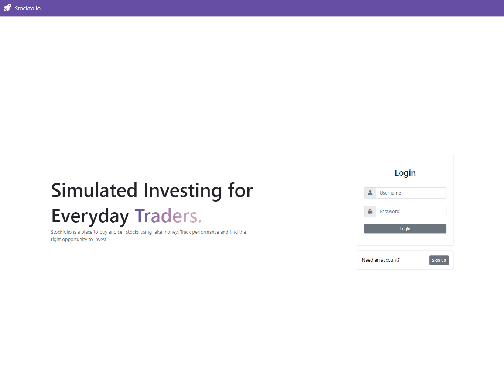

# Stockfolio

*A full stack application where a user can buy and sell stocks with fake money.*

<!-- Try it [here](https://twittersifterapi.azurewebsites.net/) -->

## Summary

This application uses, React, ASP.NET, PostgreSQL, and the IEX stock API to create a full-stack application where a user can buy and sell stocks with fake money. People can create their own profile and are granted $100,000 to purchase their stocks. The goal of this project is to create an application that can store and manipluate data on a database. I learned how to create a dynamic frontend that rendered data based on the user's profile.

## Author

* **Bryan Herrera** - *Full-Stack Developer* - [Website](http://bryan-herrera.com) | [LinkedIn](https://www.linkedin.com/in/bryan-chris-herrera/)  